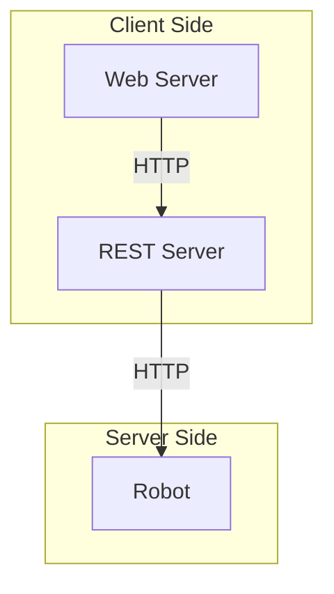

# Overview

We are creating a Rover that will map a room.  We will use REST to communicate with a Flask server.  There will also be a web site (React perhaps?) that communicates with the Flask REST server to display statistics, allow for input, etc.

# Architecture

