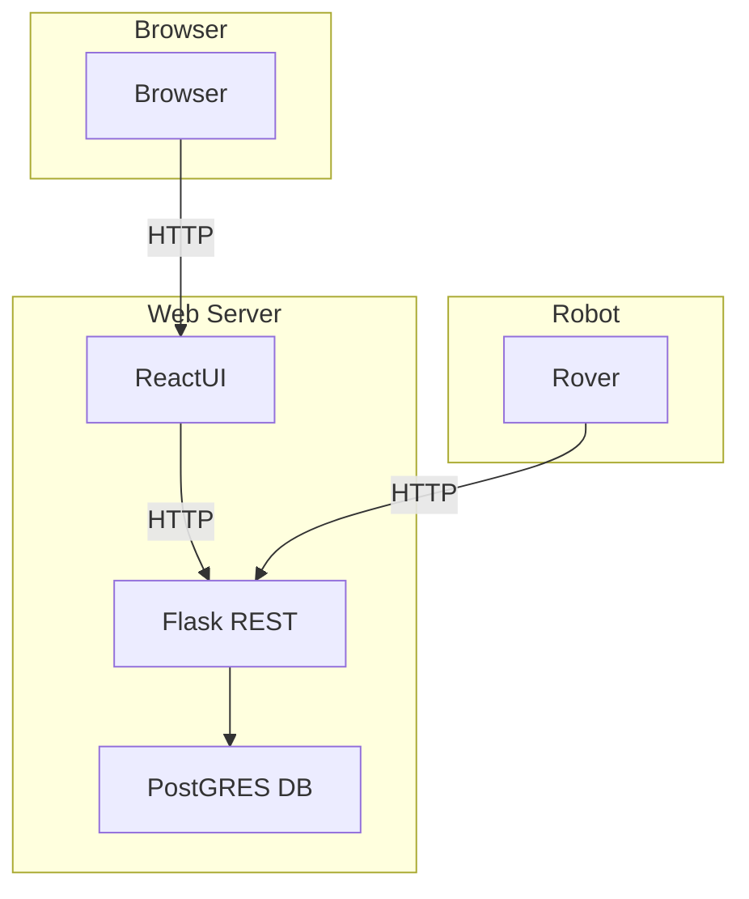

# Overview

We are creating a Rover that will map a room.  We will use REST to communicate with a Flask server.  There will also be a web site (React perhaps?) that communicates with the Flask REST server to display statistics, allow for input, etc.

# Architecture



# REST architecture

Here's a rough idea of what our routing will look like:

- GET missions
    - list all the missions the rover has executed.

- GET missions/{id}
    - retrieve details about a particular mission

- POST missions
    - create a new mission, returns an id

- POST missions/{id}/telemetry
    - sends a telemetry packet to a mission

Rough Schema:
```
{
    "time": "local time of rover"
    "type": "type of telemetry update (eg, location, collision, etc)
}
```

Example:
```
{
    "time": "2024-12-22T15:45:00Z",
    "type": "movement",
    "movement_detail": "1 inch forward"
}
```

- GET missions/{id}/instruction
    - Rover periodically (1/s) checks in with server for potential instruction

# Sequence Diagram

```mermaid
sequenceDiagram
    participant RCC as Rover Command Center (RCC)
    participant Rover
    participant Flask as Flask API
    participant Website

    RCC->>Rover: Download and start Python
    Rover->>Rover: Begin executing Python locally
    loop Periodically
        Rover->>Flask: POST /telemetry
    end
    loop Check for instructions
        Rover->>Flask: GET /mission/{id}/instruction
    end
    Website->>Flask: GET /missions/{id}/telemetry
    Flask-->>Website: Return telemetry data

